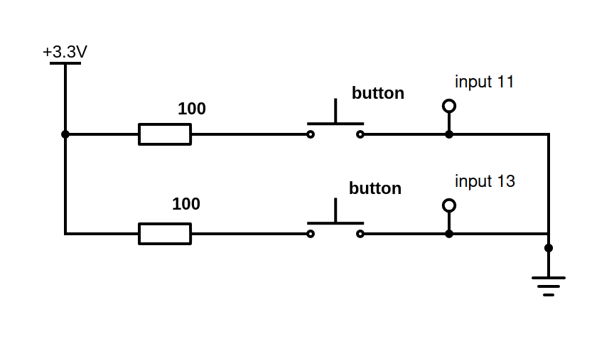

# Unitree 4D LiDAR L2

The LiDAR launch code is based on the SDK [link here](https://github.com/unitreerobotics/unilidar_sdk2/tree/main/unitree_lidar_sdk).

To establish the UDP connection (via Ethernet cable) between the LiDAR and the computer or Jetson you are using, please read the configuration instructions. You will then be provided with instructions on how to launch it.

Do not use TTL UART connection, we only use UDP. Also plug in the 12V AC/DC adapter to power on the LiDAR.

Open directly the folder named `original_sdk` to launch LiDAR that way.


## Configuration of Jetson Orin Nano Super

Run the command on a terminal. The goal is to setup the gpio pins [link here of tuto](https://docs.aerium.co.il/Tutorials/NVIDIA%20Jetson/working-with-gpio).
```
sudo /opt/nvidia/jetson-io/jetson-io.py
```

Select `Configure Jetson 40pin Header`.

Select `Configure header pins manually`.

Go on the pin's number you want to activate, and push `space` or `enter` on the keyboard to change the functions (unused / gpio / i2c2 / pwm / uarta / etc..). In that case, change the pins 11 and 13 into gpio.

After making your selections, choose `Save and reboot to configure pins`. The Jetson will automatically reboot, do not unplug the Jetson during the process.

To execute properly the code in the `src` folder, you need to build the following electrical circuit:




## Configuration of LiDAR

To configure the LiDAR, you'll need to connect it to your computer via Ethernet cable.

The goal is to find the name of the Ethernet connection (e.g. enP8p1s0). You will also find IP addresses (inet 192.168.x.x netmask 255.255.255.0). Run the following command in a terminal.
```
ifconfig
```

This command will help you to find the name of the connection (e.g. Wired connection 1).
```
nmcli connection show
```

Run the following command to check if the LiDAR is sending data. Do `Ctrl C` to stop (you can also check the IP addresses here).
```
sudo tcpdump -i enP8p1s0 -n
```

This command allows you to manually configure the network interface to ensure that the LiDAR and the machine are on the same network (this  configuration is often temporary, and you may need to reconfigure it after a reboot).
```
sudo ifconfig enP8p1s0 192.168.1.100 netmask 255.255.255.0 up
```

This command allows you to manually change the static IP address and the subnet mask.
```
sudo nmcli connection modify "Wired connection 1" ipv4.addresses 192.168.1.100/24 ipv4.method manual
```

After that, we need to reboot the network interface.
```
sudo nmcli connection up "Wired connection 1"
```

Then we check the network, and the connection with the LiDAR.
```
ip route
ping 192.168.1.62
```


## Python virtual environment

Install Python on your system if you haven't already.
```
apt install python3.10-venv
```

Create a virtual environment (rename the environment as you want).
```
python3 -m venv lidar_sdk
```

Enter the environment.
```
source lidar_sdk/bin/activate
```

Install pip (if not already here).
```
sudo apt-get install python3-pip
```

Then install all the required libraries.
```
pip install -r requirements.txt
```


**Warning:** To desactivate the virtual environment, run the command.
```
deactivate
```


**Warning:** To destroy the environment.
```
rm -rf lidar_sdk
```


## Launch LiDAR manually

Go on the `src` folder.
```
cd src/
```

Run the following command.
```
python main.py
```

You can also add arguments:
- Use a data file and not launching the liDAR (default = None) `--file-name`
- Changing the interval of time (default = 0.1) `--delta`
- Saving or not the data of the LiDAR (default = True) `--save`
- Port (default = 8050) `--port`
- Maximum of points rendering (default = 200 000) `--max-pts`
- Dark mode (default = True) `--dark-mode`


## Launch LiDAR automatically

Look in the `service` folder. Open `boot_service.txt` file, and follow the instructions re-write down here.

Run the following command.
```
sudo nano /etc/systemd/system/pin.service
```

Paste the following:
```
[Unit]
Description=Lidar 3D Application
After=network.target

[Service]
Type=simple
User=hand-e
WorkingDirectory=/home/hand-e/Documents/lidar3d_sdk
ExecStart=/home/hand-e/Documents/lidar3d_sdk/lidar_sdk/bin/python /home/hand-e/Documents/lidar3d_sdk/src/main.py
Restart=no

[Install]
WantedBy=multi-user.target
```

Do `Ctrl o` then `Enter` to save.

Do `Ctrl x` to exit.

To reload systemd.
```
sudo systemctl daemon-reload
```

To enable the service.
```
sudo systemctl enable pin.service
```

To verify the service.
```
systemctl status pin.service
```

To start right now.
```
sudo systemctl start pin.service
```

**Warning:** To disable the service.
```
sudo systemctl disable pin.service
```

**Warning:** To remove service (the reload is necessary).
```
sudo rm /etc/systemd/system/pin.service
sudo systemctl daemon-reload
```


## Processing Data from Another LiDAR

Go on the src_alexander folder.
```
cd src_alexander/
```

If the CSV files are too big, you can split it with the `split_csv.py` file by running the command:
```
python split_csv.py
```

You can also add arguments (I recommend doing this, since the files probably won't have the same names):
- Name of the CSV file (default = "../data/alexander/points-lidar3.csv") `--file`
- Name of the destination folder (default = "../data/alexander/points-lidar3") `--folder`
- Number of split wanted (default = 3) `--split`

Run the following command.
```
python main.py
```

You can also add arguments (I recommend doing this, since the files probably won't have the same names):
- Name of the CSV file (default = "-lidar3") `--file-name`
- Part of the CSV file (default = "1") `--file-part`
- Changing the interval of time (default = 0.1) `--delta`
- Angle of the LiDAR when running, in degrees (default = 30) `--angle`
- Port (default = 8050) `--port`
- Maximum of points rendering (default = 200 000) `--max-pts`
- Dark mode (default = True) `--dark-mode`


## How to use original sdk?

Open the projet directly on the folder `original_sdk`.

Compilation
```
mkdir build

cd build

cmake .. && make -j2
```

Run
```
../bin/example_lidar_udp
```

This does not process the data, it only run the LiDAR and save the data.
